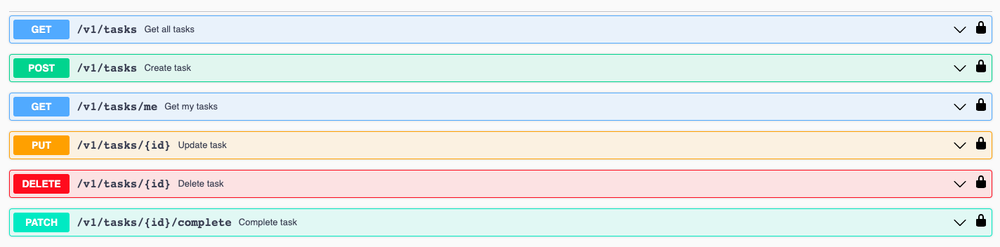

# Sword Test

This project is a Golang application built using the Echo framework to serve a RESTful API. It utilizes Swagger for API documentation, NATS as a message broker for event-based communication, MySQL as the database, and Docker for containerization. Additionally, unit tests have been implemented for the repository and usecase layers.

## Prerequisites

Make sure you have the following installed:

- Docker
- Docker compose

## Installation

- Clone the repository:

   ```shell
   git clone https://github.com/netorissi/SwordTest.git
   ```

## Usage

- To start the application locally without Docker, run the following command:

  ```shell
   make run
   ```
   OR
   ```shell
   docker-compose up -d
   ```

- Access the API documentation generated by Swagger by visiting [http://localhost:8080/swagger/index.html](http://localhost:8080/swagger/index.html) in your browser.

- Authorize the user to access the APIs. The token should be in the format `Bearer example_token_tech_1`.
Use the following tokens for testing:
`Bearer example_token_tech_1` - User tech 1
`Bearer example_token_tech_2` - User tech 2
`Bearer example_token_manager` - User manager



## Mocks

- Three test users were generated in the database for testing purposes.
1. User with ID 1 is a manager.
2. User with ID 2 is a tech user.
3. User with ID 3 is also a tech user.